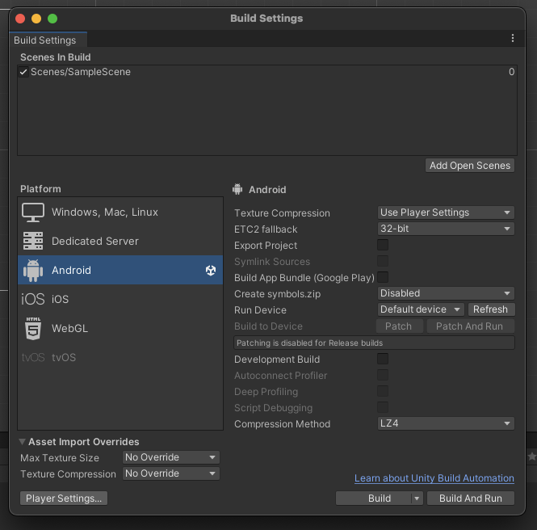
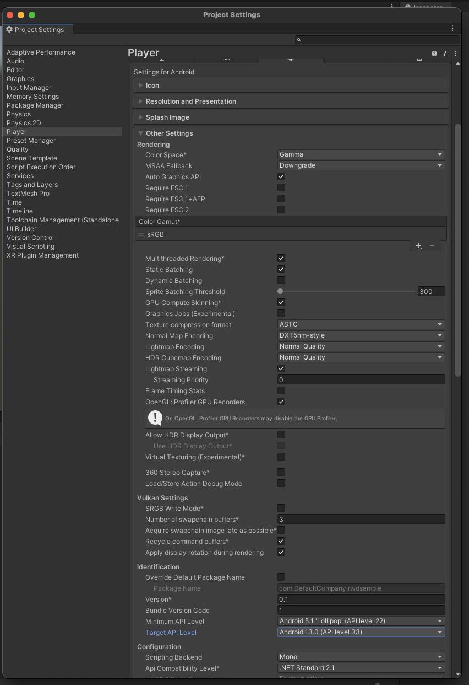

# Unity Plugin Guide

## 목차

- [1. Unity Settings](#1-unity-settings)
  - [Plugin Download](#plugin-download)
  - [Plugin Setting](#plugin-setting)
  - [Android 설정](#android-설정)
    - [gradleTemplate.properties 설정](#gradletemplateproperties-설정)
    - [baseProjectTemplate.gradle 설정](#baseprojecttemplategradle-설정)
    - [mainTemplate.gradle 설정](#maintemplategradle-설정)
    - [AdnroidMenifest.xml 설정](#adnroidmenifestxml-설정)
      - [Permission 설정](#permission-설정)
      - [Tnk App ID 설정](#tnk-app-id-설정)
      - [Offerwall Activity 설정](#offerwall-activity-설정)
      - [UnityPlayer 설정](#unityplayer-설정)
    - [proguard 설정](#proguard-설정)
  - [iOS 설정](#ios-설정)
    - [앱 추적 동의](#앱-추적-동의)
      - [앱 추적 동의 창 띄우기](#앱-추적-동의-창-띄우기)
    - [Embed Framework 설정](#embed-framework-설정)
  
- [2. Publisher API](#2-publisher-api)
  - [광고 목록 띄우기](#광고-목록-띄우기)
    - [유저 식별 값 설정](#유저-식별-값-설정)
    - [COPPA 설정](#coppa-설정)
    - [광고 목록 띄우기 (전체화면)](#광고-목록-띄우기-전체화면)
    - [EventHandler](#eventhandler)
      - [EventHandler 스크립트 만들기](#eventhandler-스크립트-만들기)
      - [GameObject에 추가하고 Handler Name 지정](#gameobject에-추가하고-handler-name-지정)
      - [설정한 Handler Name을 사용하여 Plugin API 호출](#설정한-handler-name을-사용하여-plugin-api-호출)
    - [포인트 조회 및 인출](#포인트-조회-및-인출)
    - [그밖의 기능들](#그밖의-기능들)
      - [TnkAd.Plugin - queryPoint()](#tnkadplugin---querypoint)
      - [TnkAd.Plugin - purchaseItem()](#tnkadplugin---purchaseitem)
      - [TnkAd.Plugin - withdrawPoints()](#tnkadplugin---withdrawpoints)
      - [TnkAd.Plugin - queryPublishState()](#tnkadplugin---querypublishstate)

# 1. Unity Settings

가이드의 내용대로 설정을 진행하는 참고 영상 입니다.

[샘플 영상](https://drive.google.com/file/d/1Al5AX6bRX2yeWKf5OHhMbpox18r_TwqY/view?usp=sharing)

**샘플 영상 개발 환경**

기기 : 맥스튜디오 m2

OS : ventura 13.4

유니티 : 2022.3.12f1

## Plugin Download

적용 할 Unity 프로젝트를 연 상태에서 다음 이미지와 같이 프로젝트의 Packages폴더를 오른 클릭 후 폴더를 열어주세요


Tnk에서 제공하는 tnkad-rwd.unitypackage 파일을 다운 받습니다.

**[[Unity Plugin Download](./sdk/tnk_unity_lib.zip)]**

해당 폴더에 다운받은 tnk sdk파일을 복사합니다.

Android, iOS, TnkAd 세개의 폴더가 있습니다.

기존 폴더가 있다면 폴더를 열고 해당 폴더 안의 파일들을 복사합니다.

```diff
- 주의 : 폴더를 덮어쓰기 하면 이전 내용물이 삭제 될 수 있으니 주의 하시기 바랍니다.
```


## Plugin Setting

## Android 설정

다음과 같이 안드로이드 빌드 설정 파일을 설정 해야합니다.

1. 설정에서 build and setting 메뉴를 선택합니다.


2. player settings 메뉴를 선택합니다.



3. other settings 메뉴를 선택 후 min sdk와 target sdk를 설정합니다.
(구글 정책 준수를 위해 2023년 11월 기준 target sdk 33이상으로 설정 하셔야 합니다. min sdk 권장은 21입니다.)



4. publishing settings 메뉴를 선택 후 다음 이미지의 설정을 참고하여 설정합니다.


설정 파일들을 열고 다음과 같은 설정을 추가해주세요.

### gradleTemplate.properties 설정

gradleTemplate.properties 파일에 AndroidX 설정을 추가해주세요.

```gradle
android.useAndroidX=true
android.enableJetifier=true
```


### baseProjectTemplate.gradle 설정

baseProjectTemplate.gradle 파일에 maven repository를 추가해주세요.

버전에 따라 settingsTemplate.gralde에 해당 내용이 존재하는 경우도 있습니다.

```gradle
repositories {
    // tnk repository
    maven { url "https://repository.tnkad.net:8443/repository/public/" }
}
```


### mainTemplate.gradle 설정

mainTemplate.gradle 파일에 TNK SDK 설정을 추가해주세요.

```gradle
dependencies {
    api 'com.tnkfactory:rwd:8.04.11'
}
```


### AdnroidMenifest.xml 설정

기존에 작성하신 AndroidMenifest.xml 파일에 아래 코드 중 주석으로 되어 있는 부분의 설명을 확인하시고 본인의 AndroidMenifest.xml 파일에 반영해주세요.

> ##### TnkAdAndroidMenifest.xml

```xml
<?xml version="1.0" encoding="utf-8"?>
<manifest 
  xmlns:android="http://schemas.android.com/apk/res/android" 
  package="your.package.name" 
  android:theme="@android:style/Theme.NoTitleBar" 
  android:versionName="1.0" 
  android:versionCode="1" 
  android:installLocation="preferExternal">
  
  <supports-screens 
    android:smallScreens="true" 
    android:normalScreens="true" 
    android:largeScreens="true" 
    android:xlargeScreens="true" 
    android:anyDensity="true" />
  
  <!-- permissions for TnkAd -->
   <uses-permission android:name="android.permission.INTERNET" />
   <uses-permission android:name="android.permission.ACCESS_WIFI_STATE" />
   <uses-permission android:name="com.google.android.finsky.permission.BIND_GET_INSTALL_REFERRER_SERVICE"/>
   <uses-permission android:name="com.google.android.gms.permission.AD_ID"/>
  
  <application 
    android:icon="@drawable/app_icon" 
    android:label="@string/app_name">

    <activity 
      android:label="@string/app_name" 
      android:screenOrientation="portrait" 
      android:launchMode="singleTask" 
      android:configChanges="mcc|mnc|locale|touchscreen|keyboard|keyboardHidden|navigation|orientation|screenLayout|uiMode|screenSize|smallestScreenSize|fontScale" 
      android:name="com.unity3d.player.UnityPlayerNativeActivity" android:exported="true">

      <intent-filter>
        <action android:name="android.intent.action.MAIN" />
        <category android:name="android.intent.category.LAUNCHER" />
      </intent-filter>

      <meta-data android:name="unityplayer.UnityActivity" android:value="true" />
      <meta-data android:name="unityplayer.ForwardNativeEventsToDalvik" android:value="true" /> <!-- set true -->
    </activity>
    
    <!-- TnkAd  Offerwall Activities -->
     <activity android:name="com.tnkfactory.ad.AdWallActivity"
             android:theme="@style/Theme.AppCompat.DayNight.NoActionBar"
             android:exported="true"
             android:screenOrientation="portrait"/>
    
    <!-- Set your Tnk App_ID here -->
    <meta-data android:name="tnkad_app_id" android:value="your-appid-from-tnk-site" />
  </application>
  
  <uses-feature android:glEsVersion="0x00020000" />
  <supports-gl-texture android:name="GL_OES_compressed_ETC1_RGB8_texture" />
</manifest>
```


#### Permission 설정

TnkAd SDK 가 필요로 하는 permission을 아래와 같이 설정합니다.

```xml
<uses-permission android:name="android.permission.INTERNET" />
<uses-permission android:name="android.permission.ACCESS_WIFI_STATE" />
<uses-permission android:name="com.google.android.finsky.permission.BIND_GET_INSTALL_REFERRER_SERVICE"/>
<uses-permission android:name="com.google.android.gms.permission.AD_ID"/>
```

#### Tnk App ID 설정

Tnk 사이트에서 앱 등록하면 상단에 App ID 가 나타납니다. 이를 AndroidMenifest.xml 파일의 <application> tag 안에 아래와 같이 설정합니다.

(*your-application-id-from-tnk-site* 부분을 실제 App ID 값으로 변경하세요.)

```xml
<application>

     ...

    <meta-data android:name="tnkad_app_id" android:value="your-application-id-from-tnk-site" />

</application>
```

#### Offerwall Activity 설정

Offerwall Activity는 보상형 광고목록이 출력되는 Activity입니다. 매체앱으로서 충전소 기능을 탑제하시려면 아래의 <activity/> 설정을 추가하셔야합니다.

```xml
<activity android:name="com.tnkfactory.ad.AdWallActivity"
        android:theme="@style/Theme.AppCompat.DayNight.NoActionBar"
        android:exported="true"
        android:screenOrientation="portrait"/>
```

#### UnityPlayer 설정

Unity 4.3 이상 버전을 사용하신다면 아래와 같이 ForwardNativeEventsToDalvik 옵션을 true로 설정하셔야 화면에 touch 이벤트가 동작합니다. 매체앱으로서 전면 중간광고 창을 띄우고자 하신다면 반드시 아래와 같이 설정해주세요. 광고만 진행하시는 경우에는 설정하실 필요가 없습니다.

```xml
<activity 
  android:label="@string/app_name" 
  android:screenOrientation="portrait" 
  android:launchMode="singleTask" 
  android:configChanges="mcc|mnc|locale|touchscreen|keyboard|keyboardHidden|navigation|orientation|screenLayout|uiMode|screenSize|smallestScreenSize|fontScale" 
  android:name="com.tnkfactory.spaceshootler.UnityPlayerNativeActivity" android:exported="true">

  <intent-filter>
    <action android:name="android.intent.action.MAIN" />
    <category android:name="android.intent.category.LAUNCHER" />
  </intent-filter>

  <meta-data android:name="unityplayer.UnityActivity" android:value="true" />
  <meta-data android:name="unityplayer.ForwardNativeEventsToDalvik" android:value="true" /> <!-- set true -->
</activity>
```

### proguard 설정

proguard-user.txt 파일에 아래 코드를 추가해주세요.

```proguard
// tnk SDK
-keep class com.tnkfactory.** { *;}
```


## iOS 설정

주의 : **아래의 설정을 진행 하기 전에 개발자 계정 설정 등의 준비가 완료 되어있어야 합니다.**


build setting에서 iOS로 변경 후 switch 버튼을 눌러 iOS프로젝트를 빌드합니다.

xcode프로젝트에서 다음과 같이 TnkRwd플러그인을 확인 하실 수 있습니다.


### 앱 추적 동의

앱 광고의 경우 유저들의 광고 참여여부를 확인하기 위해서는 사전에 앱추적동의를 받아야합니다.  앱추적동의는 iOS 14부터 제공되는 기능으로 기기의 IDFA 값 수집을 위하여 필요합니다. 앱 추적 동의 창은 가급적이면 개발하시는 앱이 시작되는 시점에 띄우는 것을 권고드립니다.  [앱 추적동의에 대하여 더 알아보기](https://developer.apple.com/kr/app-store/user-privacy-and-data-use/)

앱 추적 동의에 거부한 유저에게는 광고가 제한적으로 노출됩니다.

#### 앱 추적 동의 창 띄우기

앱 추적동의 창을 띄우기 위해서는 우선 info.plist 파일에 아래와 같이 "Privacy - Tracking Usage Description" 문구를 추가합니다.  추가한 문구는 앱 추적 동의 팝업 창에 노출됩니다.

작성 예시) 사용자에게 최적의 광고를 제공하기 위하여 광고활동 정보를 수집합니다.


### Embed Framework 설정

이미지와 같이 

프로젝트 설정에서 

build phases -> Embed Frameworks 항목을 열고 

+버튼을 누른 다음  TnkRwdSdk2.framework를 추가합니다.


## 2. Publisher API

Unity용 Plugin 으로 TnkAd.Plugin 클래스와 TnkAd.EventHandler 클래스가 제공됩니다.
Plugin 클래스는 광고목록이나 중간 전면광고 등의 TnkAd의 기능을 사용하기 위해서는 제공되는 클래스입니다. EventHandler 클래스는 API 중 비동기로 결과를 받아야 하는 경우에 사용되는 클래스입니다.

### 광고 목록 띄우기

다운받은 라이브러리의 TnkAd/sample/TnkUITest.cs 를 참고하세요

```c#
public class TnkUITest : MonoBehaviour
{

    void Start()
    {
#if UNITY_ANDROID        // 안드로이드의 app_id 사용
        TnkAd.RwdPlugin2.Instance.initInstance("3040807040519322223915040708030f");
#elif UNITY_IOS          // iOS의 app_id 사용
        TnkAd.RwdPlugin2.Instance.initInstance("a060a0c0f0c1c875578c1c0e070a0f01");
#endif
        // 유저 식별값 설정
        TnkAd.RwdPlugin2.Instance.setUserName("test_name");
        // COPPA 설정
        TnkAd.RwdPlugin2.Instance.setCOPPA(false);
    }

    void Update()
    {
        if (Application.platform == RuntimePlatform.Android)
        {
            if (Input.GetKeyUp(KeyCode.Escape))
            {
                Application.Quit();

            }
        }
    }

    void OnGUI()
    {
        // be sure that put handler object named 'testhandler' in your scene. (It should be named in Unity Inspector)
         
        string title = "Test Title";

        if (GUI.Button(new Rect(100, 100, 200, 80), "Show Offerwall (Activity)"))
        {
            TnkAd.RwdPlugin2.Instance.showAdList("무료 충전소");
        }
    }
}
```


#### 유저 식별 값 설정

앱이 실행되면 우선 앱 내에서 사용자를 식별하는 고유한 ID를 아래의 API를 사용하시어 Tnk SDK에 설정하시기 바랍니다.
사용자 식별 값으로는 게임의 로그인 ID 등을 사용하시면 되며, 적당한 값이 없으신 경우에는 Device ID 값 등을 사용할 수 있습니다.
(유저 식별 값이 Device ID 나 전화번호, 이메일 등 개인 정보에 해당되는 경우에는 암호화하여 설정해주시기 바랍니다.)
유저 식별 값을 설정하셔야 이후 사용자가 적립한 포인트를 개발사의 서버로 전달하는 callback 호출 시에  같이 전달받으실 수 있습니다.
(포인트 관리를 자체서버에서 하는 경우에만 해당됩니다. 1.6 Callback URL 페이지를 참고해주세요.)

##### Method

- void setUserName(string userName)

##### Parameters

| 파라메터 명칭 | 내용                                                         |
| ------------- | ------------------------------------------------------------ |
| userName      | 앱에서 사용자를 식별하기 위하여 사용하는 고유 ID 값 (로그인 ID 등)  길이는 256 bytes 이하입니다. |


```c#
using UnityEngine;
using System.Collections;

public class TnkUITest : MonoBehaviour {

  void Start ()
  {
  	TnkAd.RwdPlugin2.Instance.setUserName("test_name");
  
  // ...
}
```

#### COPPA 설정

COPPA는 [미국 어린이 온라인 개인정보 보호법](https://www.ftc.gov/tips-advice/business-center/privacy-and-security/children's-privacy) 및 관련 법규입니다. 구글 에서는 앱이 13세 미만의 아동을 대상으로 서비스한다면 관련 법률을 준수하도록 하고 있습니다. 연령에 맞는 광고가 보일 수 있도록 아래의 옵션을 설정하시기 바랍니다.

```c#
using UnityEngine;
using System.Collections;

public class TnkUITest : MonoBehaviour {

  void Start ()
  {
  	TnkAd.RwdPlugin2.Instance.setCOPPA(true); // ON - 13세 미안 아동을 대상으로 한 서비스 일경우 사용
  	TnkAd.RwdPlugin2.Instance.setCOPPA(false); // OFF - 기본값
  
  // ...
}
```

#### 광고 목록 띄우기 (전체화면)

보상형 광고 목록을 띄우기 위하여 TnkAd.Plugin 객체의 showAdList() 함수를 사용합니다.

##### Method

- void showAdList(String title)

##### Description

TnkAd.Plugin 클래스가 제공하는 메소드로서 광고 목록 화면을 띄워줍니다. TnkAd.Plugin 의 Instance 객체를 받아서 메소드를 호출해야합니다.

##### Parameters

| 파라메터 명칭 | 내용                      |
| ------------- |-------------------------|
| title         | 광고 리스트의 타이틀을 지정함(iOS한정) |

##### 적용 예시

```c#
using UnityEngine;
using System.Collections;

public class TnkUITest : MonoBehaviour {

  void Start()
    {
        
        TnkAd.RwdPlugin2.Instance.initInstance("a060a0c0f0c1c875578c1c0e070a0f01");
        TnkAd.RwdPlugin2.Instance.setUserName("test_name");
        TnkAd.RwdPlugin2.Instance.setCOPPA(true);
    }

    void OnGUI()
    {
        // be sure that put handler object named 'testhandler' in your scene. (It should be named in Unity Inspector)
         
        string title = "Test Title";

        if (GUI.Button(new Rect(100, 100, 200, 80), "Show Offerwall (Activity)"))
        {
            TnkAd.RwdPlugin2.Instance.showAdList("무료 충전소");
        }
    }
}
```

### EventHandler

EventHandler 클래스는 포인트 조회나 포인트 인출과 같이 비동기로 결과를 받아야 하는 경우 또는 중간 전면광고에서 발생하는 이벤트를 처리하기 위해서 제공되는 클래스입니다.
EventHandler 클래스의 모습은 아래와 같습니다.

> EventHandler 클래스

```c#
using UnityEngine;
using System.Collections;

namespace TnkAd {
  public class EventHandler : MonoBehaviour {
  
    // publishing state 
    public const int PUB_STAT_NO = 0; // not publishing yet
    public const int PUB_STAT_YES = 1; // publising state
    public const int PUB_STAT_TEST = 2; // testing state

    // onClose(int type)
    public const int CLOSE_SIMPLE = 0; // users simply closed ad view.
    public const int CLOSE_CLICK = 1; // users clicked ad view.
    public const int CLOSE_EXIT = 2; // users clicked exit app button.

    // onFailure(int errCode)
    public const int FAIL_NO_AD = -1;  // no ad available
    public const int FAIL_NO_IMAGE = -2; // ad image not available
    public const int FAIL_TIMEOUT = -3;  // ad not arrived in 5 secs.
    public const int FAIL_CANCELED = -4; // ad frequency setting
    public const int FAIL_NOT_PREPARED = -5; // prepare not invoked.

    public const int FAIL_SYSTEM = -9;

    // Set 'Handler Name' in Unity Inspector
    public string handlerName;
        
    // ... 

    // ServiceCallback methods
    public virtual void onReturnQueryPoint(int point) {}
    public virtual void onReturnWithdrawPoints(int point) {}
    public virtual void onReturnPurchaseItem(long curPoint, long seqId) {}
    public virtual void onReturnQueryPublishState(int state) {}

    // TnkAdListener methods
    public virtual void onFailure(int errCode) { }
    public virtual void onLoad() { }
    public virtual void onShow() { }
    public virtual void onClose(int type) { }
  }
}
```

EventHandler를 사용하기 위해서 다음과 같이 진행하세요.

1. 우선 새로운 스크립트를 생성하시고 상위 클래스를 EventHandler로 변경합니다.
2. 처리해야할 메소드를 override 하여 구현합니다. (EventHandler의 모든 메소드를 override 하실 필요는 없습니다. 처리해야햘 메소드만 구현하세요.)
3. 구현된 클래스를 Unity의 Scene 화면의 GameObject 객체에 추가합니다. (기존의 GameObject에 추가하셔도 되고 새로운 GameObject를 생성하시어 추가하여도 상관없습니다.)
4. Unity Inspector 화면에서 추가한 스크립트의 Handler Name 속성에 이름을 지정합니다. 여기에 지정된 이름이 TnkAd.Plugin의 API 호출시 사용됩니다.

#### EventHandler 스크립트 만들기

> ##### EventHandler 구현 예시

```c#
using UnityEngine;
using System.Collections;

public class MyTnkHandler : TnkAd.EventHandler {

  public override void onReturnQueryPoint(int point) {
    Debug.Log("##### onReturnQueryPoint " + point.ToString());
  }
  
  public override void onReturnPurchaseItem(long curPoint, long seqId) {
    Debug.Log("##### onReturnPurchaseItem point = " + curPoint.ToString());
    Debug.Log("##### onReturnPurchaseItem seqId = " + seqId.ToString());
  }
}
```

#### GameObject에 추가하고 Handler Name 지정


#### 설정한 Handler Name을 사용하여 Plugin API 호출

> EventHandler 사용 예시

```c#
if (GUI.Button(new Rect (100, 400, 150, 80), "Query point")) {
    Debug.Log("Query point");
    
    // be sure that put handler object named 'testhandler' in your scene. (It should be named in Unity Inspector)
    TnkAd.RwdPlugin2.Instance.queryPoint("testhandler"); 
}
```

### 포인트 조회 및 인출

사용자가 광고참여를 통하여 획득한 포인트는 Tnk서버에서 관리되거나 앱의 자체서버에서 관리될 수 있습니다.
포인트가 Tnk 서버에서 관리되는 경우에만 아래의 포인트 조회 및 인출 API를 사용하시어 필요한 아이템 구매 기능을 구현하실 수 있습니다.

#### TnkAd.Plugin - queryPoint()

Tnk서버에 적립되어 있는 사용자 포인트 값을 조회합니다. 비동기 방식으로 호출되므로 결과를 받기 위한 EventHandler 객체를 생성하셔야 합니다.

##### Method

- void queryPoint(string handlerName)

##### Description

Tnk 서버에 적립되어 있는 사용자 포인트 값을 조회합니다. 비동기 방식으로 호출되며 결과를 받으면 handlerName으로 지정된 EventHandler 객체의 onReturnQueryPoint()  메소드가 호출됩니다.

##### Parameters

| 파라메터 명칭 | 내용                                                         |
| ------------- | ------------------------------------------------------------ |
| handlerName   | 서버에서 결과가 오면 handlerName으로 지정된 EventHandler 객체의 onReturnQueryPoint(int point) 메소드가 호출됩니다. |

#### TnkAd.Plugin - purchaseItem()

TnK 서버에서는 별도로 아이템 목록을 관리하는 기능을 제공하지는 않습니다. 다만 게시앱에서 제공하는 아이템을 사용자가 구매할 때 Tnk 서버에 해당 포인트 만큼을 차감 할 수 있습니다.
비동기 방식으로 호출되므로 결과를 받기 위한 EventHandler 객체를 생성하셔야 합니다.

##### Method

- void purchaseItem(int pointCost, string itemId, string handlerName)

##### Description

Tnk 서버에 적립되어 있는 사용자 포인트를 차감합니다. 차감내역은 Tnk사이트의 보고서 페이지에서 조회하실 수 있습니다.

##### Parameters

| 파라메터 명칭 | 내용                                                         |
| ------------- | ------------------------------------------------------------ |
| pointCost     | 차감할 포인트                                                |
| itemId        | 구매할 아이템의 고유 ID (매체앱에서 자체적으로 정하여 부여한 ID) Tnk 사이트의 보고서 페이지에서 함께 보여줍니다. |
| handlerName   | 서버에서 결과가 오면 handlerName으로 지정된 EventHandler 객체의  onReturnPurchaseItem(long curPoint, long seqId) 메소드가 호출됩니다. curPoint 값은 차감 후 남은 포인트 값이며, seqId 값은 고유한 거래 ID 값이 담겨 있습니다. seqId 값이 음수 인경우에는 포인트 부족 등으로 오류가 발생한 경우입니다. |

#### TnkAd.Plugin - withdrawPoints()

Tnk 서버에서 관리되는 사용자 포인트 전체를 한번에 인출하는 기능입니다.
비동기 방식으로 호출되므로 결과를 받기 위한 EventHandler 객체를 생성하셔야 합니다.

##### Method

- void withdrawPoints(string desc, string handlerName)

##### Description

Tnk 서버에 적립되어 있는 사용자의 모든 포인트를 차감합니다. 차감내역은 Tnk사이트의 보고서 페이지에서 조회하실 수 있습니다.

##### Parameters

| 파라메터 명칭 | 내용                                                         |
| ------------- | ------------------------------------------------------------ |
| desc          | 포인트 차감에 대한 간단한 설명 Tnk 사이트의 보고서 페이지에서 함께 보여줍니다. |
| handlerName   | 서버에서 결과가 오면 handlerName으로 지정된 EventHandler 객체의  onReturnWithdrawPoints(int point) 메소드가 호출됩니다. point 값은 인출된 포인트 값입니다. 해당 사용자에게 충전된 포인트가 없는 경우에는 0이 반환됩니다. |

##### 포인트 조회 및 인출 기능 적용예시

```c#
using UnityEngine;
using System.Collections;

public class TnkUITest : MonoBehaviour {

  void Start ()
  {
  }
  
  void Update ()
  {
  }
  
  void OnGUI ()
  {
    if (GUI.Button(new Rect(100, 400, 150, 80), "Query point")) {
      Debug.Log("Query point");

      // be sure that put handler object named 'testhandler' in your scene. (It should be named in Unity Inspector)
      TnkAd.RwdPlugin2.Instance.queryPoint("testhandler"); 
    }

    if (GUI.Button(new Rect(100, 500, 150, 80), "Purchase Item")) {
      Debug.Log("Purchase Item");
        
      // be sure that put handler object named 'testhandler' in your scene. (It should be named in Unity Inspector)
      TnkAd.RwdPlugin2.Instance.purchaseItem(100, "item01", "testhandler"); 
    }
  }
}
```

### 그밖의 기능들

#### TnkAd.Plugin - queryPublishState()

Tnk 사이트의 [게시정보]에서 광고 게시 중지를 하게 되면 이후에는 사용자가 광고 목록 창을 띄워도 광고들이 나타나지 않습니다.
그러므로 향후 광고 게시를 중지할 경우를 대비하여 화면에 충전소 버튼 자체를 보이지 않게 하는 기능을 갖추는 것이 바람직합니다.
이를 위하여 현재 광고게시 상태를 조회하는 기능을 제공합니다.

##### Method

- void queryPublishState(string handlerName)

##### Parameters

| 파라메터 명칭 | 내용                                                         |
| ------------- | ------------------------------------------------------------ |
| handlerName   | 서버에서 결과가 오면 handlerName으로 지정된 EventHandler 객체의 OnReturnQueryPublishState(int state) 메소드가 호출됩니다. |

##### 적용 예시

```c#
using UnityEngine;
using System.Collections;

public class TnkUITest : MonoBehaviour {

  void Start ()
  {
    TnkAd.RwdPlugin2.Instance.setUserName("test_name");
    TnkAd.RwdPlugin2.Instance.queryPublishState("testhandler"); 
  }
  
  // ...
}
```


